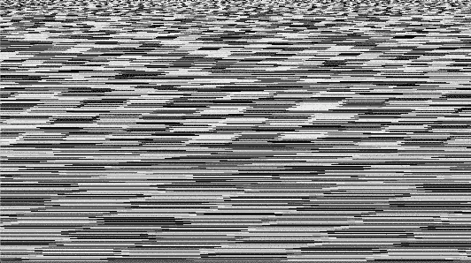

# TV Static Shader

Shader effect simulating a simple static/noise TV pattern. Made in Godot Engine 3.2.3.

It feature these settings:

- Pure static with "glitches" (default)
- Pure static (TODO)
- DPI changer (TODO) - In order to simulate low-fi displays

